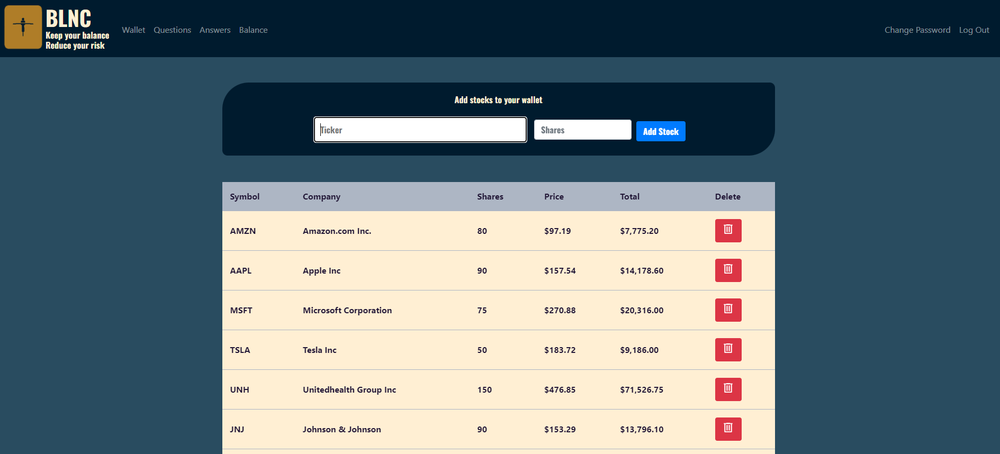
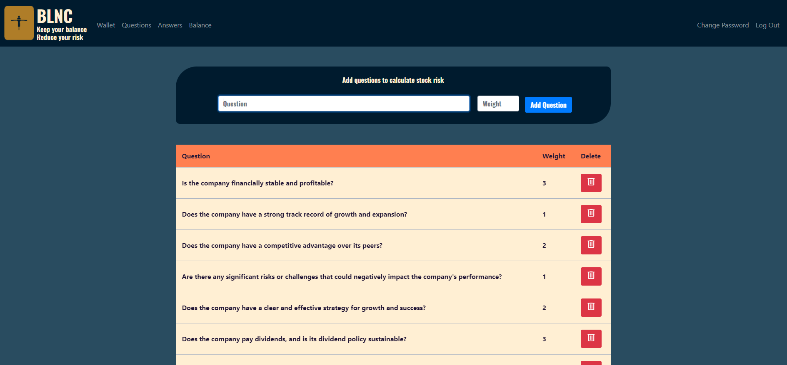
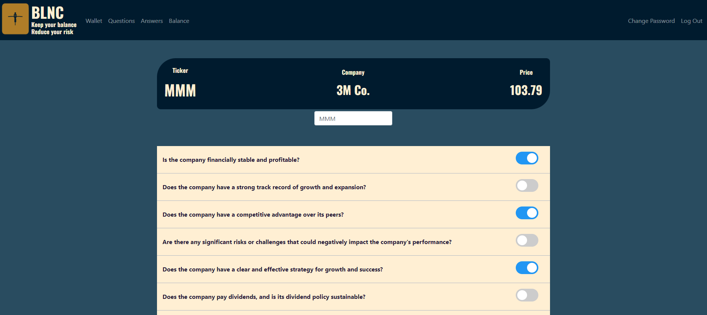
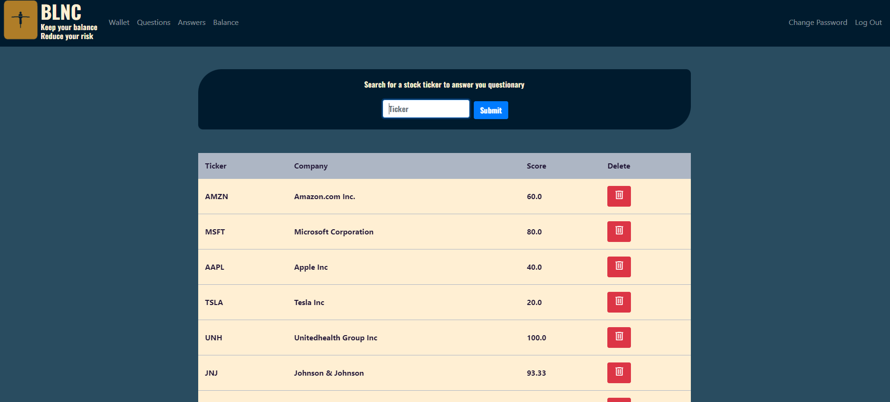
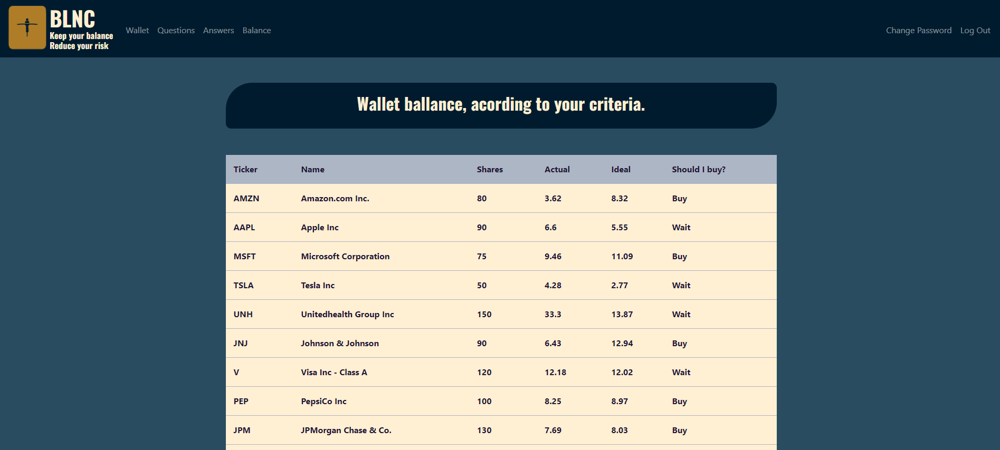

# Balance: Keep your risk controlled

### Video demo: https://youtu.be/oWccQIT2hvw

## Description

Balance is a webapp made to control the balancing of your stock portfolio with metrics that you decide yourself, through yes or no questions. Each question receives a weight that the user chooses according to the importance of that metric for him. After selecting which questions will be used to know how safe it is to invest in a company, the user answers the questions for all the stocks in his portfolio, and each stock will receive a score according to the answers.

The system then calculates the weight that each asset should have in the portfolio, respecting the calculated risk. Thus, the portfolio will be optimized so that safer stocks have a larger position in the portfolio, increasing security and profitability, without taking unnecessary risks.

Here are some images of how the system works, remembering that all assets and questions are only for demonstration purposes, and do not characterize an indication of what should or should not be analyzed when buying shares of a company.

## Screenshots

This is the home screen, the stock portfolio, where you can add the desired stock and how much of it you have in your portfolio. Everything is updated automatically like stock price, number of shares that the user owns and the total value that each stock represents in the portfolio. In the future I will add a button to edit the number of shares without having to delete and add again.

This is where the user manages the questions that he deems necessary to establish the risk of the company. You can include as many questions as you think necessary and you will also have an edit button in the next version of the app.

On this screen, the user answers the questions for each asset in their portfolio. The score is then calculated according to the weight assigned to each question. Some changes will also be made in the next version, perhaps including some other type of question that is not just yes or no, such as a value, or a range of values.

Here are listed all stocks that already have answered questionnaire, as well as score achieved. Future versions will bring all stocks in portfolios and whether questionnaire for them was answered or not.

And this is main screen, where user will monitor weight of each stock in portfolio. It shows current weight and ideal weight, good as information if user should buy new stocks or not. In next version, I will add field where user types amount of contribution and system will distribute value proportionally, informing how many shares of each asset user should buy according to typed value

## Technologies used
For the realization of this project, the Flask framework was used to transmit data to the frontend. Some bootstrap elements such as the top menu were also used. For database management, Sqlite was used and HTML and CSS were used to program the frontend. In future versions I intend to migrate everything to use react and javascript. And also a port for smartphones

## Files and directories
In the templates directory is all the front-end of app, each individual file is a html page with the necessary structure to render proprely informations, while at root directory of the application is the backend files, which makes calls to database, performs calculations and returns necessary data to the frontend. Newer versions will be optmized, so the app runs smooth and fast.

## Next steps
Now next steps will be porting this app to mobile using React native and Javascript as well as including some other utilities such as personal financial control, other stock markets, etfs, bounds and reits. I will add graphs, and make a complete controling enviroment for all kinds of investments. Real time data of prices, daily news, and more.

## Thanks
This webapp was made as the final project from Harvard´s CS50 course. I like to thank David, Brian and all the CS50 Staff that made this incredible course possible. The quality of the material and amount of knowledge that come with CS50 is incomparable. Gonna miss this. And this was CS50!